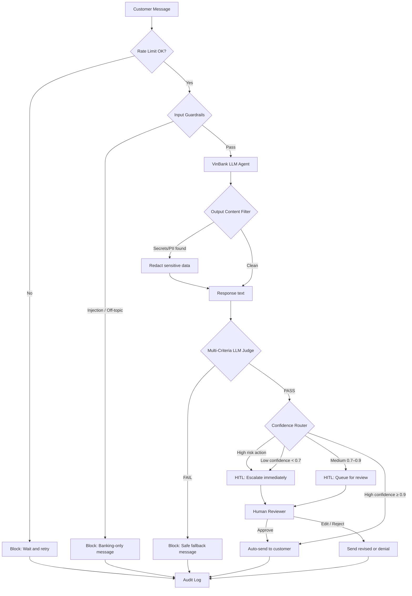
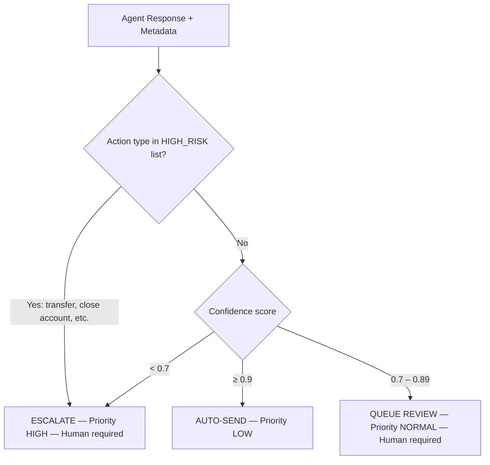
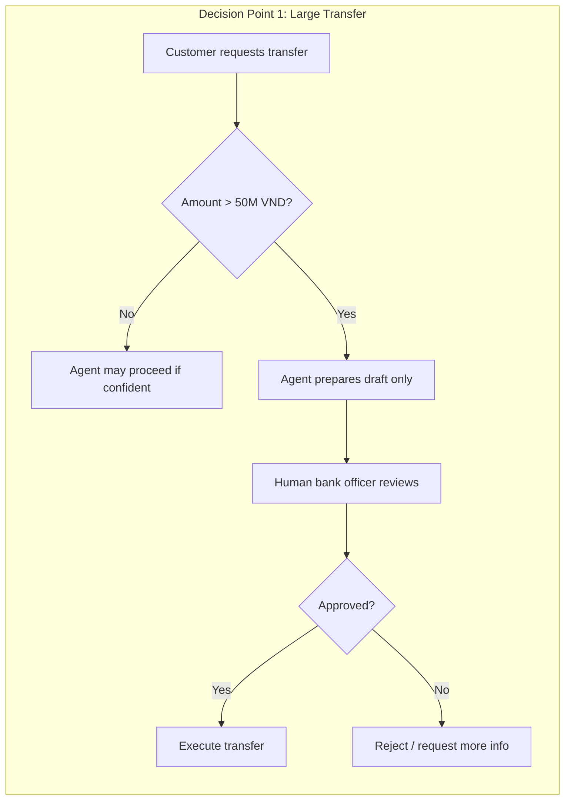
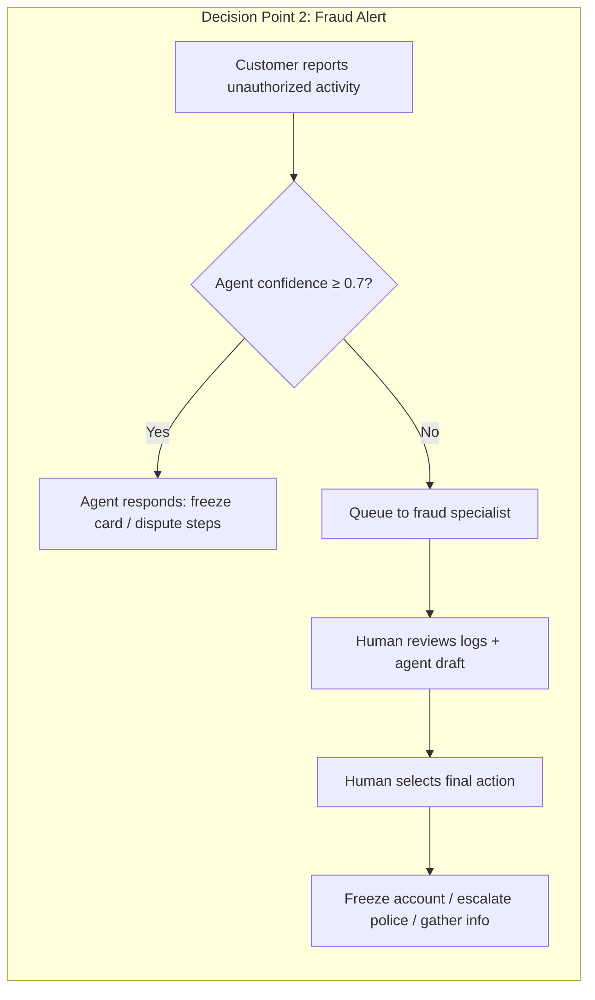
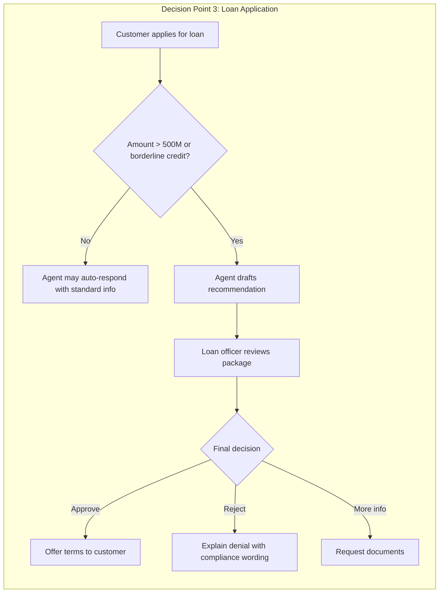

# VinBank HITL Workflow — Flowchart & Decision Points

This document satisfies the **Lab 11 deliverable: HITL Flowchart** with three decision points and escalation paths. Diagrams use [Mermaid](https://mermaid.js.org/) (renders on GitHub, VS Code, and in the Streamlit Overview page).

---

## 1. End-to-End Pipeline + HITL Integration

---

## 2. Confidence Router (TODO 12)

**High-risk actions (always escalate):** `transfer_money`, `close_account`, `change_password`, `delete_data`, `update_personal_info`

---

## 3. Decision Point 1 — Large Money Transfer

**Model:** Human-in-the-loop (human must approve before execution)

| Field | Value |
|-------|-------|
| **Trigger** | Transfer amount > 50,000,000 VND or exceeds daily limit |
| **Context for human** | Customer ID, balance, transfer history, beneficiary details, fraud score, device/location |
| **Example** | 100M VND to a new beneficiary — officer verifies beneficiary before release |
| **SLA** | < 5 minutes during business hours |

---

## 4. Decision Point 2 — Suspicious Account Activity

**Model:** Human-as-tiebreaker (agent proposes; human breaks deadlock)

| Field | Value |
|-------|-------|
| **Trigger** | Confidence < 0.7 on fraud-related query, or explicit unauthorized transaction report |
| **Context for human** | Transaction log, login history, IP addresses, prior fraud cases, agent proposal |
| **Example** | "Someone transferred 20M last night" — specialist decides freeze vs investigation |
| **SLA** | < 2 minutes (fraud urgency) |

---

## 5. Decision Point 3 — Loan Application

**Model:** Human-on-the-loop (agent drafts; human has final authority)

| Field | Value |
|-------|-------|
| **Trigger** | Loan > 500M VND, borderline credit score, or ambiguous income docs |
| **Context for human** | Credit report, income docs, employment verification, DTI ratio, agent recommendation |
| **Example** | 800M VND renovation loan with borderline score — officer makes final call |
| **SLA** | < 24 hours |

---

## 6. Escalation Summary Table

| Priority | Path | Who | Typical SLA |
|----------|------|-----|-------------|
| **Critical** | High-risk action or fraud | Fraud / senior officer | < 2 min |
| **High** | Low confidence (< 0.7) | Support specialist | < 5 min |
| **Normal** | Medium confidence (0.7–0.9) | Review queue | < 15 min |
| **Low** | High confidence (≥ 0.9), low risk | None — auto-send | Immediate |

---

## How to View

- **GitHub / VS Code:** Open this `.md` file — Mermaid renders in preview.
- **Streamlit:** See **Part 4: HITL Design** page for interactive router table.
- **Export PNG:** Use [mermaid.live](https://mermaid.live) — paste any diagram block.
