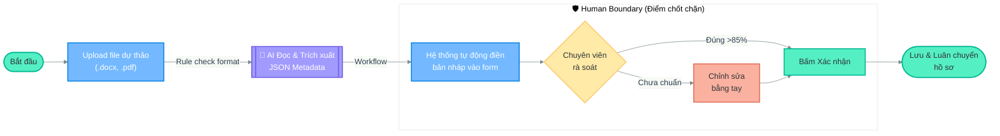

# Sơ đồ Workflow: AI Metadata Extraction

Dưới đây là sơ đồ Mermaid so sánh chi tiết giữa quy trình hiện tại (thủ công) và quy trình tương lai (có AI hỗ trợ).

## 1. Current State (Workflow Hiện tại)
> **Tổng thời gian:** 5 - 10 phút/văn bản
> **Bottleneck chính:** Nằm ở cụm đọc hiểu và tự gõ lại thông tin.

```mermaid
%%{init: {'theme': 'base', 'themeVariables': { 'primaryColor': '#f4f6f9', 'primaryTextColor': '#2c3e50', 'primaryBorderColor': '#bdc3c7', 'lineColor': '#7f8c8d' }}}%%
flowchart LR
    Start([Bắt đầu]) --> A["Nhận file dự thảo\n(.docx, .pdf)"]
    A --> B["Chuyên viên\nđọc toàn bộ văn bản"]
    
    subgraph Bottleneck ["⚠️ Bottleneck (Làm thủ công)"]
        direction TB
        B --> C["Tự tóm tắt & nhập\nTrích yếu"]
        C --> D["Rà soát & nhập\nNơi nhận"]
        D --> E["Chọn Thể loại\nvăn bản"]
    end
    
    E --> F["Kiểm tra lại\ntoàn bộ form"]
    F --> G([Bấm Lưu &\nLuân chuyển])
    
    style B fill:#ffeaa7,stroke:#fdcb6e,stroke-width:2px,color:#2d3436
    style C fill:#ff7675,stroke:#d63031,stroke-width:2px,color:#fff
    style D fill:#ff7675,stroke:#d63031,stroke-width:2px,color:#fff
    style E fill:#ff7675,stroke:#d63031,stroke-width:2px,color:#fff
    style A fill:#74b9ff,stroke:#0984e3,stroke-width:2px,color:#fff
    style F fill:#74b9ff,stroke:#0984e3,stroke-width:2px,color:#fff
    style Start fill:#55efc4,stroke:#00b894,stroke-width:2px,color:#2d3436
    style G fill:#55efc4,stroke:#00b894,stroke-width:2px,color:#2d3436
```

---

## 2. Future State (Workflow Tương lai)
> **Tổng thời gian:** Dưới 2 phút/văn bản
> **AI Intervention Point:** AI xử lý phần NLP, con người giữ vai trò kiểm duyệt cuối cùng (Human Boundary).

