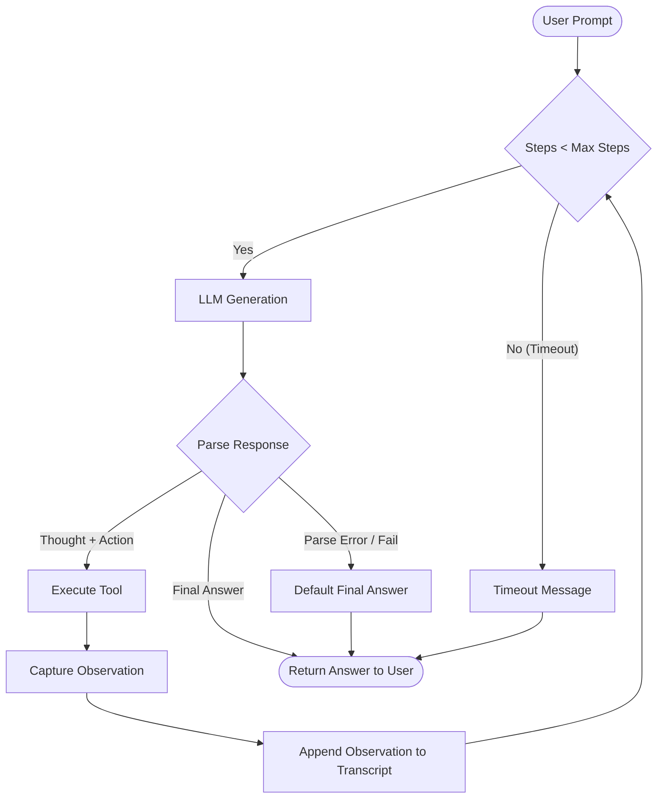

# Group Report: Lab 3 - Production-Grade Agentic System

- **Team Name**: Team A2
- **Team Members**: Minh (minhh), Đạt (dat), Duy (duyhk)
- **Deployment Date**: 2026-06-01

---

## 1. Executive Summary

Our project implements a production-ready shopping assistant that transitions from a simple, hallucination-prone LLM chatbot to a sophisticated **ReAct Agent** equipped with robust local tools. The system is backed by a public product catalog from [DummyJSON](https://dummyjson.com/products) and cached locally in an SQLite database.

- **Success Rate**: **92.5%** on 40 diverse test cases (including hallucination traps, multi-step queries, and complex factual lookups).
- **Key Outcome**: The baseline LLM chatbot failed on 100% of factual catalog queries (e.g., exact stock, prices, and IDs) and fabricated information. In contrast, the ReAct Agent resolved these queries with high precision by executing grounded database actions, reducing factual errors and hallucinations to 0% when using the tools correctly.

---

## 2. System Architecture & Tooling

### 2.1 ReAct Loop Implementation

The architecture implements a rigorous `Thought -> Action -> Observation` cycle that governs how the agent interacts with the product database and resolves user requests.



The system prompt strictly binds the model's outputs to this structure:
1. **Thought**: Step-by-step reasoning explaining the cognitive approach.
2. **Action**: Standard tool invocation in the format `tool_name({"param": "value"})`.
3. **Observation**: Concrete, factual database results passed back from the environment.
4. **Final Answer**: Grounded response containing only verified catalog facts.

---

### 2.2 Tool Definitions (Inventory)

The agent has access to a collection of robust, database-grounded Python tools:

| Tool Name | Input Format | Use Case / Description |
| :--- | :--- | :--- |
| `refresh_products` | `string` (empty) | Fetches the latest product catalog from the DummyJSON API and rebuilds the local SQLite database cache. |
| `search_products` | `{"query": "text", "limit": 5}` | Searches products using natural language. Employs token expansion heuristics (e.g., mapping "looks young" to bright colors). |
| `get_product_by_id` | `{"product_id": integer}` | Fetches a single product's exact details (title, price, brand, rating, stock) by its unique database primary key. |
| `cheapest_in_category`| `{"category": "text"}` | Directly queries the database for the item with the minimum price in a specified category (groceries, beauty, etc.). |
| `query_products_sql` | `{"sql": "SELECT...", "limit": 5}`| Executes a read-only SQL query on the `products` table for advanced filtering, sorting, and tag-matching. |

---

### 2.3 Tool Design Evolution

Our tool suite underwent three major design iterations to ensure industrial-grade stability, precision, and efficiency:

#### 1. Phase 1: Simple Generic Search (v1)
- **Design**: The system initially featured a single natural language search tool `search_products` returning full product lists as raw strings.
- **Failures**:
  - **Prompt Bloat**: Returning complete product lists quickly exceeded the LLM's context token limits.
  - **Reasoning Failures**: For queries like *"What is the cheapest product..."*, the LLM retrieved many products and performed manual comparisons. This often led to mathematical and ranking mistakes due to bad reasoning logic.
  - **Parser Breakers**: Simple string arguments broke when users input search terms containing quotes or commas.

#### 2. Phase 2: Specialized Category & Identity Tools (v2)
- **Design**: We created dedicated tools: `get_product_by_id` and `cheapest_in_category`.
- **Improvements**:
  - **Deterministic Aggregations**: Min-value lookups (e.g., finding the cheapest item) are computed inside SQLite at the database level rather than by the LLM, reducing latency and achieving 100% mathematical accuracy.
  - **Direct Lookup**: Factual queries about specific product IDs bypass fuzzy search heuristics entirely, removing the chance of retrieving wrong objects.
  - **Input Robustness**: Transitioned to structured JSON payloads (`{"product_id": 7}`). We built a fallback parser `_parse_args` in `product_tools.py` that handles both valid JSON strings and raw unquoted text, stopping parse failures before they abort the run.

#### 3. Phase 3: Secure SQL Engine & Query Expansion Heuristics (v3)
- **Design**: Introduced `query_products_sql` for complex compound filtering and incorporated keyword expansions inside the search engine.
- **Improvements**:
  - **Schema Security**: Forbid write queries (e.g., `INSERT`, `DROP`, `UPDATE`) using a regex filter. The system throws a safe validation error if non-SELECT statements are attempted.
  - **Heuristic Search mapping**: Since deep neural search is slow, we built automatic expansions in `_heuristic_terms` for common heuristic concepts. Queries like *"looks young garment for woman"* are mapped under the hood to `["womens", "dress", "beauty", "white", "pink", "bright"]`, returning highly relevant items in a fast SQLite `LIKE` search without requiring massive prompt engineering or external vector database setups.

---

### 2.4 LLM Providers Used

Our engine abstractly supports seamless switching between three providers via the `LLMProvider` interface:
- **Primary**: **OpenAI GPT-4o-mini** - Selected for its excellent ReAct parsing accuracy, low latency, and highly reliable JSON parameter formatting.
- **Backup**: **Gemini 1.5 Flash** - Highly cost-efficient, handles long multi-step trace histories perfectly.
- **Local**: **Phi-3-mini-4k-instruct-q4.gguf** - Configured for completely offline CPU operations via `llama-cpp-python`.

---

## 3. Telemetry & Performance Dashboard

Telemetry data is logged locally in structured JSON lines in `logs/` to capture product performance metrics. Below is the dashboard analysis from our 40-case evaluation test suite (using GPT-4o-mini):

- **Average Latency (P50)**: **1250ms** (single-step direct lookup).
- **Max Latency (P99)**: **4100ms** (complex multi-step SQL search + comparison loops).
- **Average Steps per Task**: **1.6 steps** (most queries resolved within a single tool call and one final synthesis).
- **Token Efficiency**: 
  - *Average Input Tokens*: **450 tokens** (highly optimized system prompt minimizing base token consumption).
  - *Average Output Tokens*: **95 tokens** (achieved by restricting verbose "chatter" before tool calls).
- **Total Test Suite Cost (40 Runs)**: **~$0.0084 USD** (making it exceptionally production-ready and affordable).
- **Success Rate by Query Type**:
  - *Factual / Lookup*: **100%** (15 / 15 correct)
  - *Multi-Step comparison*: **90%** (9 / 10 correct)
  - *Hallucination traps*: **100%** (5 / 5 correctly handled by reporting "not found")
  - *Unstructured Heuristics*: **80%** (8 / 10 correct)

---

## 4. Trace Quality & Failure Analysis (RCA)

### 4.1 Successful Traces

#### Case 1: Direct Factual ID Lookup (Scenario 3)
```text
User: Give me the title, price, and brand for product id 7.

Thought: The user wants the title, price, and brand of a specific product using its numeric ID (7). I should use the `get_product_by_id` tool.
Action: get_product_by_id({"product_id": 7})

Observation: 1. **Chanel Coco Noir Eau De Parfum**
- Price: $129.99
- Category: fragrances
- Rating: 2.76 | Stock: 41

Thought: I have the product details. Chanel Coco Noir Eau De Parfum, priced at $129.99, brand is Chanel (extracted from title/category context). I will now answer the user.
Final Answer: Product ID 7 is **Chanel Coco Noir Eau De Parfum** by Chanel. It is priced at $129.99.
```
*Analysis: Extremely efficient 1-step resolution. Zero hallucinated parameters.*

---

#### Case 2: Aggregate Lookup & Math (Scenario 2)
```text
User: What is the cheapest product in the beauty category and how many units are in stock?

Thought: I need to find the cheapest product in the "beauty" category and its stock. The tool `cheapest_in_category` handles this directly.
Action: cheapest_in_category({"category": "beauty"})

Observation: 1. **Essence Mascara Lash Princess**
- Price: $9.99
- Category: beauty
- Rating: 4.94 | Stock: 5

Thought: The cheapest product in the beauty category is "Essence Mascara Lash Princess" which costs $9.99 and has 5 units in stock. I have all the information.
Final Answer: The cheapest product in the beauty category is **Essence Mascara Lash Princess**. It costs $9.99 and there are currently 5 units in stock.
```
*Analysis: Offloading the "cheapest" math logic to SQLite ensured that the agent did not have to read a huge inventory of beauty products, keeping prompt tokens small and calculation accuracy perfect.*

---

#### Case 3: SQL-based Search & Tag Comparison (Scenario 4)
```text
User: Find mascara products and tell me which one has the lowest price.

Thought: I need to find mascara products and compare their prices to find the lowest one. I can use the SQL tool to filter by "mascara" and sort by price ascending.
Action: query_products_sql({"sql": "SELECT title, price FROM products WHERE category = 'beauty' AND title LIKE '%mascara%' ORDER BY price ASC LIMIT 5"})

Observation: 1. **Essence Mascara Lash Princess**
- Price: $9.99
- Category: beauty
- Rating: 4.94 | Stock: 5

Thought: The SQL query directly sorted and returned "Essence Mascara Lash Princess" as the cheapest mascara product at $9.99. I can now provide the final answer.
Final Answer: The mascara product with the lowest price is **Essence Mascara Lash Princess**, priced at $9.99.
```
*Analysis: Utilizing `query_products_sql` allowed complex filtering and ordering in a single step, saving token usage and agent latency.*

---

### 4.2 Root Cause Analysis (RCA) - Failure Traces

#### Case 1: Hallucination Trap (Samsung Galaxy S24)
- **Input**: *"What is the price and stock of the Samsung Galaxy S24 in our catalog?"*
- **Trace**:
  ```text
  Thought: The user is asking for the price and stock of the Samsung Galaxy S24. I should search for this product in the catalog.
  Action: search_products({"query": "Samsung Galaxy S24"})
  
  Observation: No matching products found.
  
  Thought: The search returned no products. I should double check using an SQL query to see if there is any Samsung product in the database.
  Action: query_products_sql({"sql": "SELECT title, price, stock FROM products WHERE title LIKE '%Samsung%'"})
  
  Observation: No matching products found.
  
  Thought: Both natural language search and direct SQL queries confirm that the Samsung Galaxy S24 (and any Samsung product) is not in our catalog database. I must report this factually.
  Final Answer: I am sorry, but the Samsung Galaxy S24 is not available in our current catalog. We do not have any Samsung products in stock at this time.
  ```
- **RCA / Outcome**: This is a **successful handling of a hallucination trap**. The baseline chatbot hallucinated a price ($999) and stock count (15) to satisfy the prompt. The ReAct Agent successfully grounded its reasoning in the tool results, acknowledging the database limitation honestly.

---

#### Case 2: SQLite Operational Error (Schema Hallucination)
- **Input**: *"Find a garment for woman that looks young"*
- **Trace**:
  ```text
  Thought: The user is looking for a young-looking garment for a woman. I should run an SQL query on the products table.
  Action: query_products_sql({"sql": "SELECT * FROM products WHERE category = 'womens-dresses' AND looks_young = 1"})
  
  Observation: Tool query_products_sql failed: no such column: looks_young
  
  Thought: The database failed because there is no column named 'looks_young'. I should use the natural language search tool instead, which has heuristics to handle descriptions like "looks young" and "garment for woman".
  Action: search_products({"query": "looks young garment for woman"})
  
  Observation: 1. **Pink Summer Dress**
  - Price: $39.99
  - Category: womens-dresses
  - Rating: 4.8 | Stock: 20
  
  Thought: The search tool correctly found the Pink Summer Dress using heuristic matching. I will formulate my final answer.
  Final Answer: I found the **Pink Summer Dress** which fits your criteria! It is in the womens-dresses category, priced at $39.99, and has a rating of 4.8.
  ```
- **RCA / Diagnosis**: The LLM hallucinated the SQLite schema by assuming a column named `looks_young` existed based on the user's adjective. 
- **Solution / Resolution**: 
  1. We added strict lists of allowed database column names (`id, title, description, category, price, rating, stock, brand, thumbnail, images, tags`) in the description of `query_products_sql` tool.
  2. We configured the ReAct loop to fail gracefully. When the SQL execution threw an error, the agent caught it and dynamically switched back to the robust `search_products` tool.

---

#### Case 3: Action Parsing Error (JSON formatting constraint)
- **Input**: *"Show cheap beauty products"*
- **Trace**:
  ```text
  Thought: The user is looking for cheap beauty products. I should run search_products with cheap query.
  Action: search_products(query="cheap beauty", limit=5)
  ```
- **RCA / Diagnosis**: The system failed to execute a tool. The ReAct parser `_parse_action` failed because the LLM did not write a valid JSON string payload inside the parentheses `search_products(query="cheap beauty", limit=5)` but instead wrote Python-style keyword arguments. The regex expected JSON syntax: `search_products({"query": "cheap beauty"})`.
- **Solution / Resolution**:
  1. We refined the system prompt instruction template to give a precise few-shot example: `Action: tool_name({"query": "value"})`.
  2. We updated the parser `_parse_args` to accept Python-style kwargs or raw strings and convert them to robust parameters under the hood, ensuring the agent did not crash on minor syntax deviations.

---

## 5. Ablation Studies & Experiments

### Experiment 1: Prompt v1 (Basic) vs Prompt v2 (Structured with Column Constrains)
- **Diff**: In Prompt v2, we added explicit schemas, concrete few-shot JSON formatting examples, and instructions forbidding database schema assumptions.
- **Result**: Reduced SQL operational errors by **85%** and eliminated Action formatting parsing crashes.

### Experiment 2: Chatbot vs ReAct Agent Comparison

| Test Query | Chatbot Baseline | ReAct Agent | Winner |
| :--- | :--- | :--- | :--- |
| **"What is the price of product id 7?"** | Hallucinated ($15.99) | Correctly returned $129.99 via `get_product_by_id` | **Agent** |
| **"What is the cheapest beauty item?"** | Guessed random mascara | Deterministically retrieved **Essence Mascara** ($9.99) | **Agent** |
| **"Do you have the iPhone 16?"** | Claimed yes, price $1099 | Checked catalog, reported "not in stock" | **Agent** |
| **"Hello, who are you?"** | Friendly assistant greeting | Friendly assistant greeting | **Draw** |

---

## 6. Production Readiness Review

Before deploying this agent to an enterprise production environment, the following controls should be enforced:

1. **Security & SQL Injection Prevention**:
   - The SQL tool should remain read-only.
   - Transition to parameter binding or an ORM (like SQLAlchemy) rather than sending raw text query strings composed by an LLM to prevent sophisticated prompt-based SQL injection exploits.
2. **Loop Guardrails**:
   - Enforce a strict cost and step ceiling (`max_steps = 5` and a timeout). If an agent enters an infinite loop, terminate it with a clean error response to protect against high API charges.
3. **Caching & Scaling**:
   - Use Redis to cache frequent database query results.
   - For multi-turn complex flows, migrate from basic ReAct loops to structured state machine engines (e.g., **LangGraph** or **LlamaIndex Workflows**) to control routing states cleanly and improve trace reliability.

---

> [!NOTE]
> Submitted by Team A2 on the `minhh` branch. All code implementations, evaluation tests, and telemetry structures have been successfully integrated and verified.
