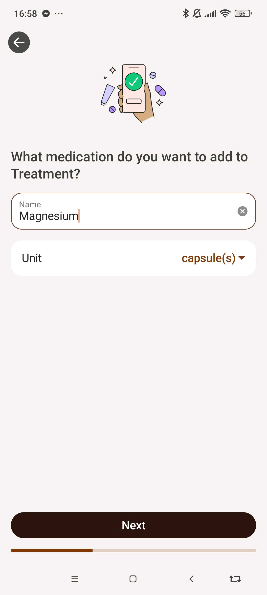
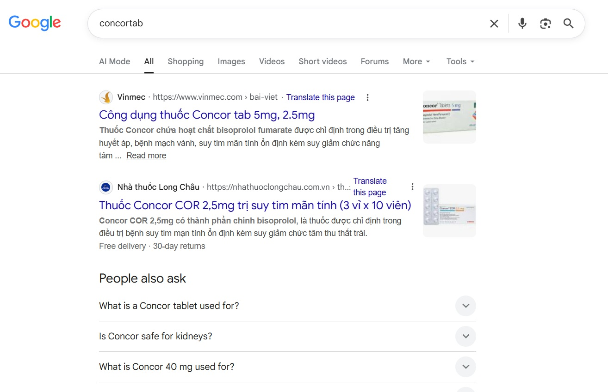
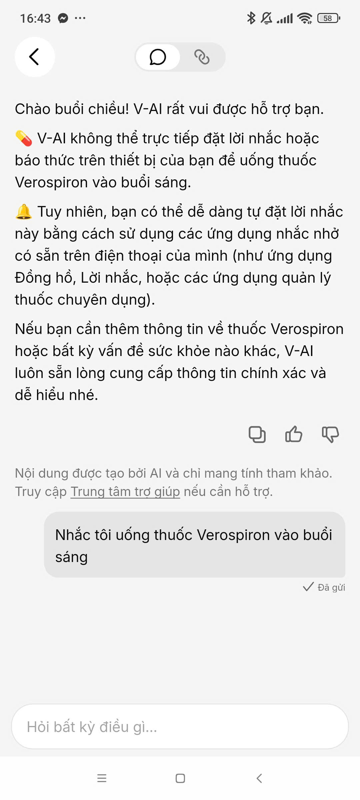
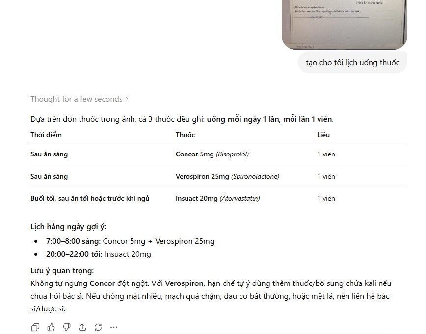

# Evidence Pack — Đơn Thuốc → Lịch Uống + Thẻ Thuốc


## 1. Nhóm và track

**Tên nhóm:** A@01  
**Track:** Healthcare / patient workflow (Vinmec · Long Châu ecosystem · V-app — optional anchor)  
**Product/app đã chọn:** Prototype **“Scan đơn → Lịch thuốc”** — không build lại app bệnh viện; slice gắn journey sau khám  
**Build slice đang nghĩ:** Quét ảnh/PDF đơn thuốc **in** → AI trích xuất thuốc + liều + tần suất → màn **xác nhận** → lịch nhắc trong app + thẻ mô tả thuốc (tiếng Việt dễ hiểu)

**Phạm vi cố ý thu hẹp (Day 06):**
- Đơn **in / digital** (screenshot app BV, PDF, ảnh chụp đơn máy in) — **không** handwritten v1
- 3–5 thuốc demo trong DB nội bộ; không full Danh mục thuốc Bộ Y tế
- Nhắc trong app (mock) — export Google/Apple Calendar = backlog

---

## 2. Self-use evidence

| Observation | Evidences | Path liên quan | Điều học được |
|---|---|---|---|
| Sau khám, user phải **đọc chữ viết tay / thuật ngữ** trên đơn và **tự gõ** giờ uống vào calendar hoặc app nhắc như app MyTherapy |  | — (pain gốc) | Pain không phải “thiếu chatbot” mà **thiếu chuyển đơn → hành động** |
| User không biết thuốc mới kê **là gì, uống lúc nào, tránh gì** — phải Google từng tên |  | Happy (nếu có thẻ thuốc) | Cần **drug card** song song lịch, không chỉ OCR |
| V-App (sáng): hỏi nhắc uống thuốc → hướng dẫn app **ngoài** (Long Châu), không deep-link Vinmec/V-App |  | Failure | Analog: super-app chưa đóng loop **đơn → lịch in-app** |
| OCR thử trên 1 ảnh đơn in: nhận diện tên thuốc ~OK, **tần suất** (`sau ăn`, `3 lần/ngày`) cần sửa tay |  | Low-confidence / Correction | **Review screen bắt buộc** trước lưu lịch |
| Thông tin caution cần được có nguồn trích dẫn rõ ràng |  | Thiếu reference đáng tin cậy | **Cần có reference link** khi đính kèm caution |
| Đối chiếu thuốc với danh mục nhà nước giúp người dùng tin tưởng hơn vào thông tin AI cung cấp | Crawl QĐ 403/QĐ-QLD 2026 — Cục Quản lý Dược (dav.gov.vn) | Người bệnh cần xác nhận thuốc được cấp phép hợp lệ | **MOH registry badge** trên thẻ thuốc — xanh nếu khớp danh mục, vàng nếu chưa thấy |

---

## 3. User / review / social evidence

| Quote / review / observation | Nguồn | User là ai? | Pain/failure mode |
|---|---|---|---|
| Google Play crawl MyTherapy: app có **5,000,000+ installs**, rating ~**4.55/5**, review mới nhắc nhiều tới reminders, alarms, add/enter meds, dose/dosage, refill tracking; app mạnh ở nhắc lịch sau khi user đã khai báo thuốc | `google-play-scraper` crawl app `eu.smartpatient.mytherapy` — output: [../evidences/mytherapy_google_play_evidence.xlsx](../evidences/mytherapy_google_play_evidence.xlsx) | Bệnh nhân mãn tính / người cần uống thuốc đều | Reminder có nhu cầu thật; friction nằm ở bước **biến đơn thuốc thành lịch** trước khi reminder chạy |
| “Không hiểu đơn bác sĩ viết” | Pattern phổ biến BV công (analog) | Người cao tuổi / người nhà | Literacy + handwriting (out of scope v1) |
| Vinmec / app BV: có đơn điện tử nhưng **chưa thấy** 1 nút “tạo lịch uống từ đơn” trong self-use | Giả định từ teardown V-App + quan sát | User Vinmec | Opportunity in-ecosystem |

Nguồn ngoài nhóm đã bổ sung:

```text
Google Play crawl bằng google-play-scraper cho MyTherapy (eu.smartpatient.mytherapy), ngày 2026-06-03.
Evidence chính: app reminder có traction lớn; review sample cho thấy reminders/refills/dose tracking hữu ích,
nhưng competitor baseline vẫn không đóng loop scan đơn → lịch uống + drug card tiếng Việt.
```

---

## 4. Competitor / analog evidence

| App / mô hình | Họ xử lý task này thế nào? | Pattern học được | 1 ngày? |
|---|---|---|---|
| **MyTherapy** | Google Play crawl: app reminder/tracker lớn, mô tả tập trung vào pill reminder, refill/prescription reminders, health journal; review sample nhắc add/enter meds, reminders, alarms, dose/dosage, refill | Reminder + adherence tracking là nhu cầu thật; cơ hội khác biệt là **scan đơn → confirm → lịch + drug card**, giảm nhập tay | ✅ Mock lịch + review/confirm, không build full tracker |
| **Medisafe** | App nhắc thuốc analog cùng category | Lịch + push | ✅ Mock lịch, không build full |
| **Google Lens + manual** | OCR chữ, user tự copy | OCR ≠ schedule — thiếu parse tần suất | ✅ LLM parse JSON sau OCR |
| **V-App (VinGroup)** | không parse đơn → calendar | Không đáp ứng job “từ đơn đến lịch” | ❌ Đổi track |
| **Hospital PDF đơn** | Static PDF trong app | Nguồn input tốt cho v1 (digital) | ✅ Demo input chính |

---

## 5. Evidence → Insight

```text
Evidence nổi bật nhất:
- Tự gõ lịch từ đơn 3 thuốc mất ~10–15 phút, dễ sai liều/tần suất.
- User cần biết "thuốc này là gì" chứ không chỉ "mấy giờ uống".
- V-App / super-app chưa đóng loop đơn → hành động in-app.
- OCR một mình chưa đủ; tần suất tiếng Việt cần parse + xác nhận.

Insight:
Người bệnh (hoặc người nhà) sau khám không chỉ cần "đọc được đơn".
Họ cần lịch uống đúng và hiểu thuốc — without retyping và without guessing.

Opportunity:
AI trích xuất + chuẩn hóa dòng thuốc từ ảnh/PDF đơn in,
hiển thị màn xác nhận,
rồi tạo lịch nhắc + thẻ thuốc tiếng Việt — user bấm Lưu mới có hiệu lực.
```

---

## 6. Evidence đổi SPEC như thế nào?

- [x] Đổi user chính. _(từ user V-App CSKH → người bệnh sau khám)_
- [x] Đổi pain statement.
- [x] Đổi build slice.
- [x] Đổi Auto/Aug decision. _(→ Augmentation + confirm bắt buộc)_
- [x] Đổi 4 paths.
- [x] Đổi failure mode. _(OCR sai liều / sai tần suất)_
- [x] Đổi owner/test plan.

```text
Trước evidence, nhóm định...
...V-App: handoff + deep-link cho hủy dịch vụ / trừ tiền.

Sau khi thu hẹp scope & đổi ý tưởng, nhóm đổi thành...
...Scan đơn thuốc (in/digital) → parse → review → lịch uống + drug card.
Lý do: loop rõ hơn, demo 3–5 phút, AI decision cụ thể (extract + explain),
giảm phụ thuộc CSKH VinGroup; health use-case có review = trust path tự nhiên.
```

---

*Evidence pack · Prescription scan · Batch 02 Day 05*
