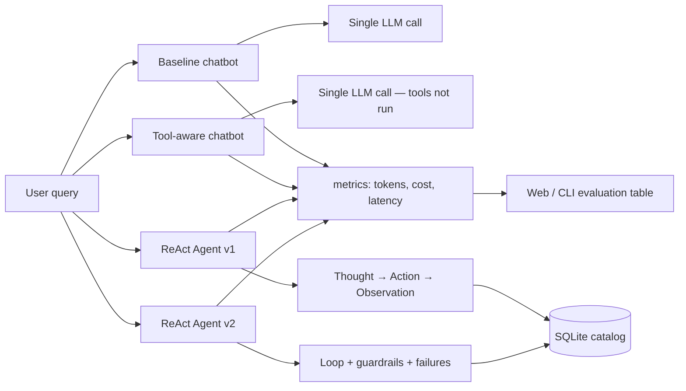
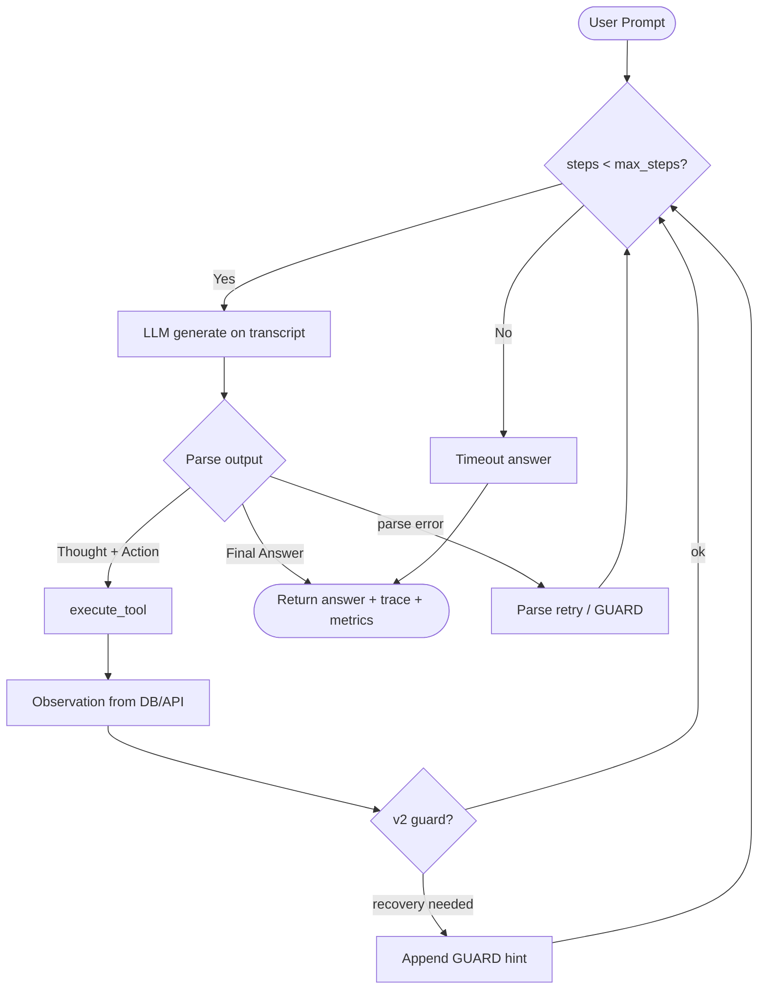

# Group Report: Lab 3 - Chatbot vs ReAct Agent

- **Team Name**: Team A2
- **Team Members**: Minh (minhh), Đạt (dat), Duy (duyhk)
- **Branch**: `minhh` (integrated `duyhk` + `dat`)
- **Date**: 2026-06-01

---

## 1. Executive Summary

We built a **four-mode comparison system** for a DummyJSON product shopping assistant. All modes share the same catalog ([dummyjson.com/products](https://dummyjson.com/products)) cached in SQLite at `data/products.sqlite3`, but they differ in whether tools are described, executed, and monitored.

| Mode | Implementation | Tools executed? |
| :--- | :--- | :--- |
| **Baseline chatbot** | `src/chatbot/baseline.py` | No |
| **Tool-aware chatbot** | `src/chatbot/tool_aware.py` | No (tools in prompt only; can fake `Observation:` text) |
| **ReAct Agent v1** | `src/agent/agent.py` | Yes — Thought → Action → Observation loop |
| **ReAct Agent v2** | `src/agent/agent_v2.py` | Yes — v1 + guardrails, failure codes, image preservation |

**Key outcomes (lab scenarios, live / simulate demos):**

- **Baseline** and **tool-aware** chatbots routinely invent prices, stock, and product names on factual catalog questions.
- **Tool-aware** mode is especially misleading: it may write plausible `Action:` / `Observation:` blocks **without calling any tool**.
- **Agents (v1/v2)** ground answers in SQLite/API observations; on the hallucination trap (Samsung Galaxy S24), they search the DB and report *not found* instead of inventing inventory.
- **Agent v2** adds structured `failures[]` telemetry (e.g. `HALLUCINATED_TOOL`, `EMPTY_RESULT`, `DUPLICATE_ACTION`) and recovery hints in the transcript.

**Automated 40-case benchmark** (`python run_evaluation.py`, simulate mode — see `report/EVALUATION_DASHBOARD.md`):

| Metric | Result |
| :--- | :--- |
| Product name in final answer | **67.5%** (27/40) |
| Total estimated cost (40 runs) | **$0.01038 USD** |
| Avg latency (simulate) | **~0.17 s** per case |
| Total tokens (simulate) | **48,800** |

> **Note:** The 40-case suite uses `SimulatedLLMProvider` by default for reproducible grading without API keys. Heuristic-search cases fail more often in simulate mode because the mock LLM picks simplified tool arguments. For production claims, re-run with `python run_evaluation.py --live` and label the provider in the dashboard.

**How to reproduce demos**

```bash
python web_demo.py              # http://127.0.0.1:5000 — Simulate (no API key)
python web_demo.py --live       # real LLM from .env
python demo_compare.py --simulate
python demo_compare.py --scenario 2
python run_evaluation.py        # regenerate EVALUATION_DASHBOARD.md
```

---

## 2. Team Contributions

| Member | Branch | Primary deliverables |
| :--- | :--- | :--- |
| **Duy** | `duyhk` | SQLite `ProductCatalog`, product tools, heuristic search, `product_chat.py`, agent skeleton |
| **Minh** | `minhh` | Baseline + tool-aware chatbots, Agent v1/v2, web demo (`web_demo.py`, `web/`), `demo_compare.py`, scenarios, token/cost UI, merges |
| **Đạt** | `dat` | `run_evaluation.py` (40-case suite), `report/EVALUATION_DASHBOARD.md`, group report structure, CLI metrics in `product_chat.py` |

All three branches are merged on `minhh`.

---

## 3. System Architecture

### 3.1 Four-mode comparison flow



**Entry points**

| Artifact | Role |
| :--- | :--- |
| `web_demo.py` + `web/index.html` | Side-by-side UI, scenario picker, token & cost summary |
| `demo_compare.py` | Terminal 4-mode compare + `--simulate` |
| `run_evaluation.py` | 40-case agent benchmark → markdown dashboard |
| `src/product_chat.py` | Interactive CLI (`AGENT_VERSION=v1\|v2`) |

### 3.2 ReAct loop (Agent v1 & v2)



**Output format (agents):** `Thought` → `Action: tool_name({json})` → environment `Observation` → … → `Final Answer`.

### 3.3 Agent v1 vs v2

| Feature | v1 (`agent.py`) | v2 (`agent_v2.py`) |
| :--- | :--- | :--- |
| ReAct loop | Yes | Yes |
| Parse retry | Basic | `max_parse_retries` + GUARD observations |
| Unknown tool | Error string in observation | `HALLUCINATED_TOOL` + valid-tool list |
| Duplicate action | No | Blocked; cleared after successful `refresh_products` |
| Empty catalog | Manual | Auto `refresh_products` + `EMPTY_CATALOG` |
| Images in answer | Optional | Collect from observations; `MISSING_IMAGES_IN_ANSWER` guard |
| Telemetry | `metrics`, `trace` | + `failures[]`, `images_preserved` |

**v2 failure codes (rule-based, not ML):**  
`EMPTY_CATALOG`, `EMPTY_LLM_RESPONSE`, `PARSE_ERROR`, `DUPLICATE_ACTION`, `HALLUCINATED_TOOL`, `TOOL_ERROR`, `EMPTY_RESULT`, `NOT_FOUND`, `TIMEOUT`, `MISSING_IMAGES_IN_ANSWER`.

---

## 4. Tooling

### 4.1 Tool inventory

| Tool | Input | Purpose |
| :--- | :--- | :--- |
| `refresh_products` | `""` or `{}` | Fetch from DummyJSON API; rebuild SQLite cache |
| `search_products` | `{"query": "...", "limit": 5}` | Heuristic NL search (`_heuristic_terms` expansions) |
| `relaxed_search_products` | `{"query": "...", "limit": 5}` | Broader token matching |
| `get_product_by_id` | `{"product_id": N}` | Exact row by ID |
| `cheapest_in_category` | `{"category": "beauty"}` | SQL `MIN(price)` for category |
| `list_by_category` | `{"category": "..."}` | List products in category |
| `query_products_sql` | `{"sql": "SELECT ...", "limit": 5}` | Read-only SQL (`SELECT` only; writes rejected) |

Catalog formatting includes Markdown thumbnails: ``.

### 4.2 Tool design evolution

**Phase 1 — Generic search only**  
Single `search_products` returned large blobs; the LLM compared prices manually and often erred.

**Phase 2 — Specialized tools**  
Added `get_product_by_id`, `cheapest_in_category`, JSON args via `_parse_args`. Aggregations run in SQLite, not in the model.

**Phase 3 — SQL + heuristics + robust parsing**  
Added `query_products_sql`, `list_by_category`, `relaxed_search_products`, schema hints in tool descriptions, and `_heuristic_terms` for queries like *“garment for woman that looks young”*.

**Phase 4 — Integration fixes (minhh)**  
- `_parse_category()` so `cheapest_in_category({"category": "beauty"})` does not stringify the dict into a bogus category key.  
- Parameterized SQL for category min-price.  
- v2 clears duplicate-action memory after a successful catalog refresh.

### 4.3 LLM providers

Via `src/core/factory.py` (`LLMProvider` interface):

- **OpenAI** — `gpt-4o-mini` (default for demos)
- **Gemini** — `gemini-1.5-flash` (empty-response handling in provider)
- **Local** — `Phi-3-mini-4k-instruct-q4.gguf` via `llama-cpp-python`

Set `DEFAULT_PROVIDER` in `.env`.

---

## 5. Telemetry & Evaluation

### 5.1 Per-run metrics (all four modes)

Each `run()` returns a `metrics` object built by `src/telemetry/metrics.py`:

- `llm_calls`, `prompt_tokens`, `completion_tokens`, `total_tokens`
- `latency_ms`, `cost_usd` (pricing table for gpt-4o-mini / gpt-4o / Gemini)
- `simulated` flag when using mock estimates

`build_comparison_evaluation()` aggregates per-mode totals for the web UI and `demo_compare.py`.

### 5.2 Lab scenarios (`src/demo/scenarios.py`)

| ID | Name | Query focus |
| :---: | :--- | :--- |
| 1 | Hallucination trap | Samsung Galaxy S24 (not in catalog) |
| 2 | Cheapest + stock | `cheapest_in_category(beauty)` |
| 3 | Factual ID | `get_product_by_id(7)` → Chanel Coco Noir |
| 4 | Search + compare | Mascara products, lowest price |

### 5.3 40-case automated suite

`run_evaluation.py`:

1. Refreshes SQLite from API  
2. Auto-generates 40 cases (ID lookup, cheapest-in-category, heuristic search)  
3. Runs **ReAct Agent v1** with live or simulated LLM  
4. Writes `report/EVALUATION_DASHBOARD.md`

**Latest simulate dashboard (2026-06-01):** 67.5% name-match accuracy; failures cluster on heuristic NL search cases where the simulated model uses a weak default query.

### 5.4 Logging

Structured JSON events via `src/telemetry/logger.py` → `logs/YYYY-MM-DD.log` (created at runtime). Event types include `CHATBOT_START`, `AGENT_TOOL_OBSERVATION`, `AGENT_TOOL_ERROR`, `AGENT_IMAGE_GUARD`.

---

## 6. Trace Quality & Failure Analysis

### 6.1 Four-mode contrast — Scenario 1 (hallucination trap)

**Query:** *What is the price and stock of the Samsung Galaxy S24 in our catalog?*

| Mode | Typical behavior |
| :--- | :--- |
| Baseline | Invents price/stock (e.g. $999, 15 units) |
| Tool-aware | May show fake `Observation:` without DB call |
| Agent v1/v2 | `search_products` → empty → optional SQL → **not in catalog** |

**Agent v2 (representative trace):**

```text
Action: search_products({"query": "Samsung Galaxy S24"})
Observation: No matching products found.
Action: query_products_sql({"sql": "SELECT title, price, stock FROM products WHERE title LIKE '%Samsung%'"})
Observation: No matching products found.
Final Answer: The Samsung Galaxy S24 is not in our current catalog.
```

### 6.2 Successful trace — Scenario 2 (cheapest beauty)

**Query:** *What is the cheapest product in the beauty category and how many units are in stock?*

```text
Thought: I need the minimum-price beauty item and its stock from the database.
Action: cheapest_in_category({"category": "beauty"})

Observation: 1. **Red Nail Polish**
- Price: $8.99
- Category: beauty
- Rating: … | Stock: 79


Final Answer: The cheapest beauty product is **Red Nail Polish** at **$8.99** with **79** units in stock.
```

*v2 appends thumbnail markdown if the model omits images (`MISSING_IMAGES_IN_ANSWER`).*

### 6.3 Successful trace — Scenario 3 (product id 7)

```text
Action: get_product_by_id({"product_id": 7})
Observation: **Chanel Coco Noir Eau De Parfum** — $129.99, fragrances, stock 41
Final Answer: Product ID 7 is **Chanel Coco Noir Eau De Parfum**, priced at $129.99.
```

### 6.4 RCA — Category argument bug (real failure we fixed)

**Symptom:** `cheapest_in_category({"category": "beauty"})` → *No matching products found* despite a full cache.

**Cause:** Category was parsed as the string `"{'category': 'beauty'}"` instead of `beauty`.

**Fix:** `_parse_category()` + parameterized SQL. v2 also clears `seen_actions` after `refresh_products` so a valid retry is not blocked as `DUPLICATE_ACTION`.

### 6.5 RCA — SQL schema hallucination

**Input:** *Find a garment for woman that looks young*

```text
Action: query_products_sql({"sql": "... AND looks_young = 1"})
Observation: Tool failed: no such column: looks_young
Action: search_products({"query": "looks young garment for woman"})
Observation: **Pink Summer Dress** — $39.99, …
```

**Lesson:** Document allowed columns in `query_products_sql`; on `TOOL_ERROR`, switch to heuristic `search_products`.

### 6.6 RCA — Tool-aware fake observation

Tool-aware mode may output:

```text
Action: cheapest_in_category({"category": "beauty"})
Observation: Essence Mascara, $9.99, stock 5
```

…with **no tool execution** (`used_tools: false`). This is intentional for the lab: it shows why ReAct must **execute** tools, not only describe them.

---

## 7. Ablation & Comparison Experiments

### 7.1 Four-mode summary (Scenarios 1–4)

| Scenario | Baseline | Tool-aware | Agent v1 | Agent v2 |
| :--- | :--- | :--- | :--- | :--- |
| 1 Hallucination trap | Often hallucinates | Fake tool narrative | Grounded “not found” | + `failures[]` if tools misused |
| 2 Cheapest beauty | Guesses | Fake observation | DB-grounded price/stock | + images enforced |
| 3 Product id 7 | Wrong price common | May guess | Correct via `get_product_by_id` | Same + guards |
| 4 Mascara compare | Invents list | Invents comparison | Search/SQL loop | Recovery hints on empty SQL |

### 7.2 Token & cost (simulate, Scenario 2 — illustrative)

Web UI and `demo_compare.py --simulate` show **relative** cost: baseline ≈ 1 LLM call; agents ≈ 2+ calls with higher tokens but factual answers. Exact numbers depend on provider; see per-run `metrics` in API responses.

### 7.3 Prompt / parser improvements

- Few-shot `Action: tool_name({"key": "value"})` in agent system prompts  
- `_parse_args` accepts JSON, Python kwargs, or raw strings  
- v2 `GUARD:` observations after `PARSE_ERROR`, `HALLUCINATED_TOOL`, `EMPTY_RESULT`

---

## 8. Production Readiness (honest assessment)

| Area | Current state | Next step |
| :--- | :--- | :--- |
| **Grounding** | Strong when tools run correctly | Supervisor check: prices must appear in observations |
| **Security** | Read-only SQL filter | Parameterized queries / ORM instead of LLM-written SQL |
| **Cost control** | `max_steps`, metrics per run | Per-user budgets; cache hot queries (Redis) |
| **Failure detection** | Rule-based codes in v2 | Not a learned hallucination detector — document as guardrails |
| **Memory** | `history` on agent is not yet fed into multi-turn CLI | Wire conversation context for follow-ups |
| **Evaluation** | 40-case suite = agent v1 only | Extend benchmark to score all four modes on same cases |

---

## 9. Repository Map (submission snapshot)

```
src/chatbot/          baseline.py, tool_aware.py
src/agent/            agent.py (v1), agent_v2.py (v2)
src/tools/            product_tools.py (SQLite catalog)
src/telemetry/        metrics.py, logger.py, evaluation.py
src/demo/             scenarios.py, mock_metrics.py
web/                  index.html, app.js, styles.css, mock_traces.json
web_demo.py           Flask 4-mode API
demo_compare.py       CLI compare
run_evaluation.py     40-case benchmark
report/
  EVALUATION_DASHBOARD.md
  group_report/GROUP_REPORT_TeamA2.md
  individual_reports/REPORT_Minh.md (and teammates TBD)
```

---

> **Submitted by Team A2** on branch `minhh`.  
> Compare all four modes in the web UI or `demo_compare.py`; regenerate metrics with `run_evaluation.py`.  
> Individual accountability: each member submits `report/individual_reports/REPORT_[Name].md` per course template.
